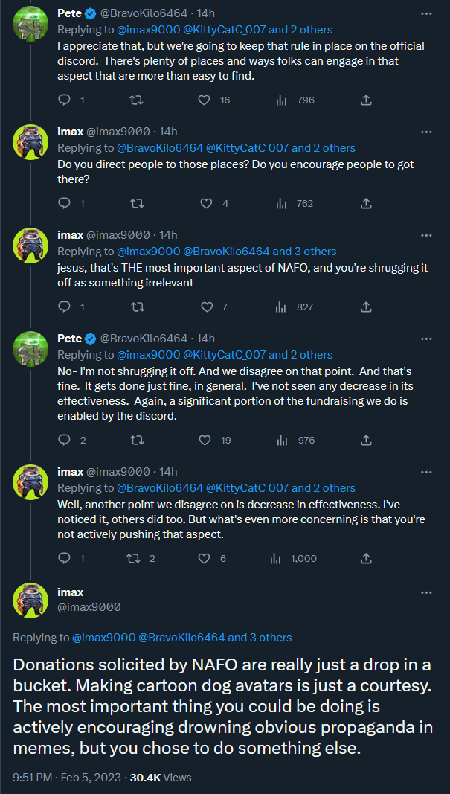

I wrote this and I want to apologise to everyone for belittling their
contributions.  Although that wasn't my intention, with the way I expressed
things I did it anyway.

Every single donation, no matter the amount, helps to save lives. And I *am*
grateful to each and every one of you for that.

## Decentralisation

Before continuing, I must address the claim that NAFO is decentralised. It's
true that there are a lot of fellas who pay little to no attention to
`@Official_NAFO`. It is also true that there's a significant cluster of fellas
who think highly of them and listen to what they say. And this extends to the
moderator staff of the Discord server for many fellas who are present there.

So messages and views of the core of this cluster have influence on many fellas,
and, to a varying degree, on the rest of the network. De jure NAFO is not
centralised, de facto - it is, even though the level of influence is lower than
in a usual centralised organisation.

## Why I said what I said

The context of the conversation was about what `@Official_NAFO` and NAFO Discord
are doing (or not doing) to steer NAFO activities. What differentiates NAFO
from other fundraising communities is bonking. Countering propaganda as a swarm
of loosely coordinated accounts turned out to be quite effective. One of the
goals of russian propaganda is to waste people's time and brainpower on claims
that are false and ridiculous in the first place; but when you're just
shitposting memes - you're doing precisely the correct thing: completely
ignoring the content and helping others to ignore it too.

Sadly, the core of that major NAFO cluster, which is centred around NAFO
Discord, stands aside from that activity, instead focusing on fundraising,
merch, and other things. They do provide people with a sense of belonging, but
that too serves to strengthen the centralization.

I am grateful for every cent of donations coming to Ukraine. Every Ukrainian is.
But it's very concerning to see a community becoming very self-centred and
using fundraising/donations as a shield from criticism.

So this is why I said "donations are a drop in a bucket" - to inspire some
humility by putting the donations into a larger context. I'm sorry that at the
same time I ended up belittling the contributions of a lot of people who I
believe to be helping genuinely and selflessly.

## Where do I want to go from here

I still believe that fundraising is a minor part of NAFO's potential. I agree
that there's a place in NAFO for everyone helping Ukraine. It is amazing to see
people engaging in support of Ukraine in many different ways, this raises
awareness all over the world, and motivates people to do much more. At the same
time there's no real necessity to apply the "NAFO" label to many activities
outside of bonking; you can still be a fella even if you do something else.

I still believe that effective bonking adds an order of magnitude more value
than fundraising or anything else NAFO has been doing to date. This is
something we have not seen before, and setting it aside as "something people
do/organise elsewhere" greatly reduces the impact NAFO has.

## Sidenote about Come Back Alive

Given the amount of centralisation within NAFO, it's absolutely unacceptable for
anyone with significant influence to attempt to tarnish the reputation of Come
Back Alive, whom Ukrainians trust with their lives and the lives of their
families. If there are any real concerns about their activities - I'm pretty
sure Zaluzhny would bring them up directly with Taras Chmut. Casting shade on
them by posting some vague allegations (y'know, the usual "i'M jUsT aSkInG
kUeShChUnS" stuff for example) only sows unsubstantiated mistrust in them.
Their finances are transparent, and if you think you know better than Zaluzhny
and other people from the Ukrainian government who they work very closely
with - please reach out to them, instead of posting stuff on Twitter.
